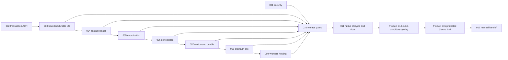

# Charon premium hardening loop

Generated with the `improve` skill in `plan` mode on 2026-08-09 at commit
`a0543d0bc9ba49d2eb21f631d5e76104a920fd58`, then reconciled on 2026-08-11 at
commit `7294773` with the compact-shelf and GitHub-only release direction.

This directory is an advisory execution queue. It does not replace the accepted
product plans in `plans/`; executors must preserve their histories and physical
evidence gates. The queue covers Workspace durability and scale, desktop
correctness and polish, the static Astro site, Cloudflare Workers Static Assets,
release gates, documentation, and final manual acceptance.

## Non-negotiable contract

- Before every plan, read `AGENTS.md`, `README.md`, PRODUCT, ARCHITECTURE,
  PRIVACY, relevant UX/SITE and ADRs, `plans/README.md`, and the complete current
  product plan.
- Use Bun only for JavaScript/TypeScript and Cargo for Rust. Keep dependencies
  exact and update the fixed ledger.
- Preserve accepted `Workspace`, `CaptureCoordinator`, `ClipboardComposer`,
  `Selection`, `Tag`, and `Attachment` meanings.
- Preserve local-only desktop behavior. No account, sync, analytics, telemetry,
  crash/content upload, automatic Paste, arbitrary input injection, or runtime
  site API.
- Astro remains `output: 'static'`. Cloudflare Workers serves generated files
  through Static Assets; no Astro server adapter or Worker application code.
- Product Plan 015 owns a new distribution ADR before release changes. macOS
  remains ad-hoc/not notarized, Windows remains unsigned, and a Tauri updater
  signature must never be described as Apple or Windows publisher identity.
- GitHub Releases owns application artifacts and `/releases/latest`; Cloudflare
  owns only static-site hosting. The site makes no browser GitHub API request.
- Do not push, tag, publish, deploy, install, rotate keys, or open a PR without
  explicit operator authority.

## Execution order

| Plan | Title | Priority | Depends on | Status |
|---|---|---:|---|---|
| 001 | Remove the release dependency vulnerability baseline | P0 | - | TODO |
| 002 | Accept the bounded Workspace transaction protocol | P0 | - | TODO |
| 003 | Make commits authoritative and Attachment I/O bounded | P0 | 002 | TODO |
| 004 | Replace full Workspace snapshot churn with a scalable read protocol | P1 | 003 | TODO |
| 005 | Serialize drafts, commands, events, and Workspace switches | P1 | 004 | TODO |
| 006 | Close desktop command, Tag, focus, and preview correctness gaps | P1 | 005 | TODO |
| 007 | Execute compact product Plans 016-017, then close motion and bundle gaps | P1 | 006 | TODO |
| 008 | Make the static site truthful, localized, accessible, and product-grade | P1 | 007 | TODO |
| 009 | Move static hosting from GitHub Pages to Cloudflare Workers | P1 | 008 | TODO |
| 010 | Turn release gates into measurements of production behavior | P1 | 001, 003-009 | TODO |
| 011 | Close native lifecycle and documentation drift | P1 | 010 | TODO |
| 012 | Run final automation and hand over the complete manual matrix | P1 | 011 + Product 014 complete + Product 015 protected draft ready | TODO |

Status values: `TODO`, `IN PROGRESS`, `DONE`, `BLOCKED: <evidence>`,
`AWAITING MANUAL`, `FAILED: <evidence>`.



## Deterministic loop protocol

Use one integration branch for the entire queue:

```sh
git switch -c codex/premium-loop
```

If it exists, switch without recreating it. Start from a clean worktree with
these plans committed.

Each iteration:

1. Select the lowest-numbered `TODO` whose dependencies are `DONE`.
2. Read it completely; mark it `IN PROGRESS` here and in the file.
3. Run its drift check. Reconcile the advisory plan if assumptions changed.
4. Execute in order and stop on every STOP condition.
5. Run all listed verification, then `bun run check` and
   `cargo test --manifest-path apps/desktop/src-tauri/Cargo.toml --locked` unless
   explicitly documentation-only.
6. Review the whole diff for generated files, secrets, privacy, vocabulary,
   architecture, and unrelated user changes.
7. Mark `DONE` only when all criteria pass; commit once with the exact message.
8. Continue automatically.

Plan 007 is the controlled two-branch detour: execute
`plans/016-refine-premium-desktop-shelf.md` on
`codex/016-compact-desktop-shelf`, merge it back, then execute
`plans/017-align-compact-shelf-features.md` on
`codex/017-compact-feature-alignment` and merge it back. Use each product plan's
exact commits and advisor Plan 007's exact merge messages. Reconcile drift after
Plans 001-006; do not rewrite the locked direction or discard user work.

After Advisor Plan 011, leave the advisor branch only through the documented
product-plan handoff: execute Product Plan 014 completely, then Product Plan 015
through an operator-authorized protected GitHub draft with Tauri-signed updater
artifacts. Product Plan 015 may truthfully be `AWAITING OPERATOR` at that point.
Resume Advisor Plan 012 against those exact draft artifacts; its evidence is the
manual acceptance Product Plan 015 requires before public promotion. Never
publish first merely to make `/releases/latest` testable.

On a STOP, record `BLOCKED: <concrete evidence>` and continue only with an
independent executable plan. End when no executable TODO remains, when the
Product 014/015 handoff needs operator authority, or when Advisor Plan 012 is
`AWAITING MANUAL`. The product is not release-accepted until a human completes
Plan 012 against exact candidate artifacts and explicitly promotes the approved
GitHub draft.

## Copy-paste loop prompt

```text
Execute advisor-plans/README.md as a deterministic loop on branch
codex/premium-loop. Read AGENTS.md and all required contracts before every plan.
Always choose the lowest-numbered executable TODO, run its drift check, implement
every step, run every verification, and STOP on stated conditions. Use each exact
commit message and update status only after done criteria pass. Continue until no
executable TODO remains. Do not push, publish, deploy, install, tag, or weaken a
privacy/product contract. After Advisor Plan 011, follow the Product 014 then
Product 015 protected-draft handoff before Advisor Plan 012. At Plan 012
AWAITING MANUAL, stop and return its entire manual matrix with evidence fields.
```

## Current official references

- Cloudflare Static Assets: <https://developers.cloudflare.com/workers/static-assets/>
- Cloudflare SSG/custom 404:
  <https://developers.cloudflare.com/workers/static-assets/routing/static-site-generation/>
- Wrangler configuration: <https://developers.cloudflare.com/workers/wrangler/configuration/>
- Core Web Vitals: <https://web.dev/articles/vitals>
- Tauri v2: <https://v2.tauri.app/>
- Tauri updater: <https://v2.tauri.app/plugin/updater/>
- Tauri macOS signing: <https://v2.tauri.app/distribute/sign/macos/>
- Tauri Windows signing: <https://v2.tauri.app/distribute/sign/windows/>
- GitHub stable latest-release links:
  <https://docs.github.com/en/repositories/releasing-projects-on-github/linking-to-releases>
- Astro: <https://docs.astro.build/>

At planning time, official Cloudflare docs specify `assets.directory` and
`not_found_handling: "404-page"` for this SSG. Planned Wrangler is exactly
`4.120.0`; recheck docs/registry before editing without using a floating pin.

## Rejected directions

- Astro SSR/server adapter, Worker code, KV/D1/R2, CMS, forms, analytics,
  observability, accounts, or sync.
- Wholesale dependency updates or unreviewed transitive overrides.
- Persisted search database by default; Plan 004 starts with a versioned,
  ephemeral local read model and ADR gate.
- Removing virtualization, fake site UI/media, global blocking spinners, generic
  Error navigation, automatic Paste, clipboard monitoring, or broader input
  synthesis.
- Adding arbitrary Attachment thumbnails or pre-Note composer Attachments to
  mimic the reference video.
- Treating Tauri update signatures as notarization, Authenticode, or a way to
  suppress platform installation warnings.
