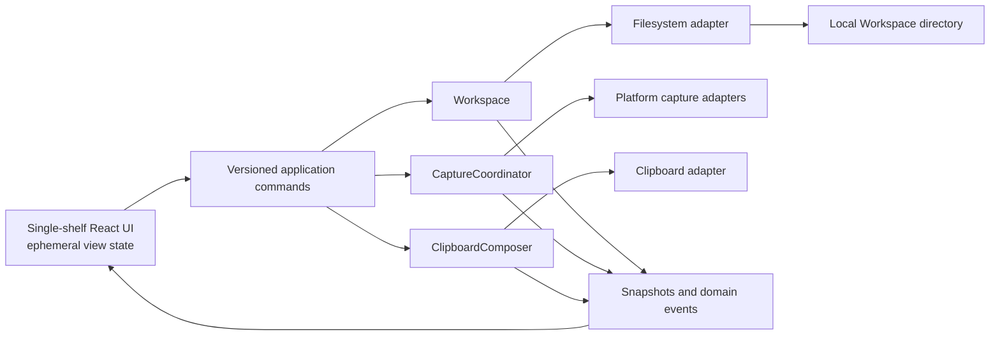

# Charon architecture contract

This contract implements [ADR 0011](adr/0011-rapid-capture-product.md), as
amended by [ADR 0012](adr/0012-unified-note-shelf.md) and
[ADR 0013](adr/0013-direct-note-actions.md).

## Authority and boundaries

Rust is the authority for domain rules, Workspace files, migration, managed
Attachments, and durable state. React never reads or writes Markdown, the
manifest, Attachment bytes, backups, migration archives, or temporary files. It
dispatches versioned application commands over IPC and renders typed snapshots
and events returned by Rust.

The core consists of three deep modules:

- `Workspace` owns persistence and every durable domain mutation.
- `CaptureCoordinator` owns platform shortcut activation, capture permissions,
  gesture classification, selected-text acquisition, and capability fallback.
- `ClipboardComposer` owns deterministic `Copy as Markdown` composition and
  explicit clipboard writes.

These modules collaborate through narrow domain inputs. Capture does not write
files, clipboard composition does not activate shortcuts or read Attachment
bytes, and React does not reimplement either module's rules.

## Component map



## Workspace layout and durability

One local directory is one Workspace. First-run bootstrap resolves a safe
default under Documents in the application layer, then delegates all creation,
opening, validation, and folder switching to the same Workspace boundary.
Schema v2 has this direction:

```text
<workspace>/
  charon.workspace.json
  notes/
    <note-uuid>.md
  attachments/
    <note-uuid>/
      <attachment-uuid>[.<safe-extension>]
  backups/
  legacy-trash-v1/
    README.md
    manifest.json
    notes/<uuid>.md
```

`charon.workspace.json` stores the schema version and durable metadata required
to validate and deterministically order flat Notes, Tags, and Attachment
records. Each Markdown body lives in `notes/<note-uuid>.md`. Each Attachment is
owned by exactly one Note and its generated relative path must resolve inside
that Note's managed directory after canonical validation. `backups/` contains
bounded transaction or migration recovery material, not a second active source
of truth. `legacy-trash-v1/` is a visible migration-only, user-owned archive
created only when v1 already contains trashed bodies; it is never part of the
active schema v2 collection.

Every replacement write uses a uniquely named temporary file in the same
directory as its destination, flushes as required by the platform, and performs
an atomic rename. A multi-file command is one Workspace transaction whose
versioned recovery record names the exact changed bodies, added or removed
Attachments, and removed Notes. Staging stores both manifest revisions but only
the changed file versions; applying or recovering touches only that recorded
change set, with the manifest rename remaining the single commit point. Records
from older Charon builds that do not contain a change set retain the full-state
recovery path. Completed permanent deletion still removes the bounded previous
copies with the transaction directory. Charon preserves the last valid state
and reports conflicts instead of silently selecting a winner.

Schema limits are explicit constants with deterministic boundary tests. A Note
has at most 16 Tags of 1-48 Unicode scalar values after trimming, with no
control or line-break character and case-insensitive uniqueness. It has at most
20 Attachments of at most 100 MiB each. The explicit picker runs in Rust and
returns only short-lived opaque one-shot tokens to React; the webview never
handles source paths. Adding one accepts only an explicitly selected regular
non-symlink file outside every Charon Workspace. Rust never persists the source
path, streams into a same-directory staged file with a bounded aggregate import
budget, derives a validated display basename and generated UUID relative path,
and commits bytes plus manifest metadata atomically without retaining the full
Attachment batch in memory.

Removing an Attachment follows the same permanent cleanup rules as deleting its
Note.

Successful permanent deletion has a special completed-record rule: after the
commit becomes authoritative, active files and normal transaction backups
contain neither deleted Markdown nor managed Attachment bytes. A crash may
leave a bounded incomplete record only until the next open deterministically
finishes or rolls back the transaction and removes that record. This rule does
not claim deletion from operating-system snapshots, external backups, or synced
folder histories.

Filesystem notifications are hints rather than authority. The watcher keeps a
bounded coalesced path set, folds overflow into one full reload marker, ignores
transaction-internal paths, and asks `Workspace` to
re-read and validate changed content. Identical self-writes do not advance the
revision. Invalid or deleted known files leave the last valid snapshot in place
and create a contextual health issue; unknown Markdown remains an explicit
import decision rather than being silently adopted.

## Schema v1 migration

Schema v1 to v2 migration is a Workspace transaction. It validates the complete
source and stages a bounded pre-migration recovery record before mutation. Each
active v1 Note preserves stable UUID, body bytes, status, and timestamps; Tags
and Attachments start empty. Former grouping and manual sort metadata are not
carried into the flat active model.

Already-trashed v1 bodies move to visible plain Markdown under
`legacy-trash-v1/notes/<uuid>.md` with an explanatory README, archived metadata
without bodies, and original v1 manifest metadata. They never re-enter active
search or status results automatically. This archive is the durable exception
to the new completed-deletion cleanup guarantee because it preserves content
created before that command existed. Charon reports its location and leaves
later inspection, movement, or removal to the user. The bounded recovery record
is removed after convergence. An existing archive path stops migration before
mutation rather than being merged.

Opening an interrupted migration deterministically returns the Workspace to the
complete prior schema or completes v2 before accepting another mutation.
Mismatch or invalid content stops mutation and returns a typed recovery choice;
it never skips content or claims partial success.

## Deep modules

### Workspace

`Workspace` absorbs manifest and Markdown parsing, Tag and Attachment
validation, deterministic Note ordering, schema migration, command application,
transaction cleanup, filesystem watching, external-change reconciliation,
conflict detection, recovery, and snapshot production. These responsibilities
belong together because they protect stable identity, valid managed paths,
recoverability, and no lost content.

The two persistence seams are a real-filesystem adapter for production and
integration tests and an in-memory Workspace adapter for fast domain and
failure-path tests. They implement the same observable command contract. A new
seam requires a distinct platform or testing reason; no entity repository or
generic service layer sits between commands and Workspace.

### CaptureCoordinator

`CaptureCoordinator` translates a platform capability into a typed capture
action. It owns global accelerator registration, modifier-sequence adapters,
permission state, selected-text acquisition, duplicate suppression, listener
lifecycle, and fallback selection. Its output is either one flat Note-creation
action or a request to reveal Charon and focus the bottom composer, never direct
file access.

The application layer maps a Note-creation action to exactly one versioned
Workspace command. It maps the portable accelerator to a main-window focus
event. This keeps `CaptureCoordinator` independent from persistence and React
view state.

The macOS modifier adapter remains the public, passive Core Graphics event tap
defined by ADRs 0008-0010. It forwards normalized events into the pure double-
Shift state machine and never suppresses or rewrites an operating-system event.
After a valid unmodified gesture, it first runs the bounded, cycle-safe public
Accessibility candidate and representation ladder. Only when that returns no
usable text may it run ADR 0010's single-flight pasteboard snapshot, one
synthetic source Copy, bounded wait/read, and change-count-guarded restoration.
It never posts Paste or another key, monitors clipboard history, persists a
snapshot, overwrites a concurrent clipboard change, or runs without explicit
intent.

Input Monitoring independently gates the macOS event tap; Accessibility gates
selected-text acquisition and the bounded source Copy. Tauri's global-shortcut
plugin owns `CmdOrCtrl+Shift+Space` on every platform. Linux and Windows expose
the same capability model but do not claim modifier-only capture until their
native physical matrices pass on the exact release-configuration artifact.

### ClipboardComposer

`ClipboardComposer` accepts one immutable Note value and its resolved Attachment
metadata. It produces one deterministic Markdown document and performs one
explicit clipboard write through an adapter. The Note has no invented heading
and its body stays exact. `**Tags:**` contains safely delimited inline-code spans
in stored order only when Tags exist. `**Attachments:**` contains one bullet per
Attachment in creation/UUID order with safe display name and canonical absolute
managed path as inline code only when Attachments exist. The delimiter is longer
than every backtick run in metadata. Rust resolves and validates every managed
path before the clipboard changes; one missing or escaping reference fails the
command.

Composition is testable without a system clipboard. It never reads Attachment
bytes or external source paths, changes Note status, uploads, pastes, or mutates
Workspace files. It remains separate from the transient
pasteboard transaction owned by `CaptureCoordinator`.

## IPC and view-state contract

IPC exposes versioned command and event DTOs generated for TypeScript by
`ts-rs`. Persisted JSON, Markdown, managed relative paths, and migration records
are implementation details rather than a frontend API. Breaking DTO changes
require an explicit version strategy and coordinated Rust and TypeScript tests.

React receives a complete Workspace snapshot at open, followed by ordered
domain events or replacement snapshots. It owns only ephemeral search, Tag
filter, expanded-editor presentation, draft, copy feedback, and Preferences-
surface state. Note-row focus remains browser-native rather than product state.
Durable state becomes real only after a successful Rust command response.
Contextual failures preserve user input and expose typed, content-free recovery
without a generic error destination.

## Dependency rule and monorepo boundary

The dependency direction remains:

```text
single-shelf UI -> application commands -> domain modules -> adapters
```

Dependencies never point in reverse. Domain modules do not import React, Tauri
UI code, platform implementations, or persisted frontend state. Adapters
implement ports owned by the domain boundary. Removing old entities removes
conditions and dependencies; it does not justify compatibility wrappers.

The permitted monorepo sharing remains:

```text
apps/desktop -> packages/theme
apps/site    -> packages/theme
```

Neither application imports the other. `packages/theme` is framework-neutral
and exports semantic CSS variables, theme names, and motion and radius contracts
only. Brand assets, localization, components, native types, and Motion helpers
remain app-owned. Astro stays static and currently serves a media-free holding
page. If product media returns, it must come from the real app rather than fake
styled UI. Astro gains no server adapter, account, form, analytics, CMS, or
runtime API.

The public build is deployed as ordinary Cloudflare Workers Static Assets. The
checked-in deployment configuration has no Worker entry point, binding, runtime
variable, secret, or server route. Production uses the custom domain
`charon.simonhazard.com`; the `workers.dev` route and Preview URLs are disabled.

## Change control

ADR 0011, as amended by ADR 0012 and ADR 0013, governs the flat schema v2
direction, irreversible per-Note deletion, shortcut reduction, unified shelf,
direct Note actions, Light default, and rejected chart surface. Create another
ADR before changing persistence, local-only privacy, shortcut support, bulk
interaction, cross-app sharing, the static-site boundary, or the dependency
rule. New adapters must correspond to a real platform boundary or distinct test
seam.
