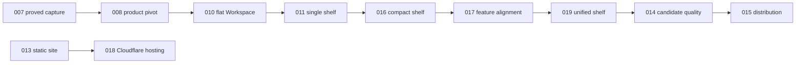

# Charon implementation plans

This directory is the single implementation queue. Completed plans remain as
historical evidence even when a later ADR removes their product choices. Read
the current contract and the active plan; never resume a superseded feature from
an older plan.

The product pivot is governed by
[ADR 0011](../docs/adr/0011-rapid-capture-product.md). The unified shelf,
Light/Graphite appearances, direct row actions, editor transition, and
Attachment picker permission are governed by
[ADR 0012](../docs/adr/0012-unified-note-shelf.md).

## Active handoff

Plan 019 is the current desktop plan on branch
`codex/019-simplify-unified-shelf`, based on `8bdcda1`. Its automated gates pass,
including compact Light/Graphite review. It remains `AWAITING OPERATOR` for one
native macOS Attachment-picker click and a normal-speed unfold/fold feel check.

Plan 018 is independently `AWAITING OPERATOR` for Cloudflare/GitHub environment
configuration and the first authorized matching `main` deployment. It does not
change desktop release readiness.

After Plan 019, Plan 014 closes the exact-candidate quality matrix. Plan 015
then defines protected GitHub Release artifacts and optional Tauri-signed
updates without pretending ad-hoc macOS or unsigned Windows artifacts have paid
publisher identity.

See [LAUNCH.md](./LAUNCH.md) for development commands.

## Status

| Plan | Title | Status |
| --- | --- | --- |
| 001 | Freeze original contracts | DONE |
| 002 | Scaffold the Bun/Tauri monorepo | DONE |
| 003 | Build the deep local Workspace | DONE |
| 004 | Establish themes, shell, and localization | DONE |
| 005 | Deliver the original Note workflow | DONE |
| 006 | Build ClipboardComposer | DONE |
| 007 | Prove selected-text capture and native shortcuts | DONE |
| 008 | Refound Charon around rapid capture | DONE |
| 009 | Integrate the original brand/theme system | DONE |
| 010 | Simplify Workspace and agent-ready copy | DONE |
| 011 | Build the single-shelf desktop | BLOCKED: remaining physical accessibility and motion matrix |
| 012 | Add Preferences and platform fallbacks | BLOCKED: remaining native platform matrix |
| 013 | Build the static product site | DONE |
| 016 | Retarget the desktop to a compact shelf | DONE |
| 018 | Host the static site on Cloudflare Workers | AWAITING OPERATOR: secrets, authorized main run, and NEL setting |
| 017 | Align all workflows inside the compact shelf | REJECTED: presentation replaced by ADR 0012 and Plan 019 |
| 019 | Simplify the unified Note shelf | AWAITING OPERATOR: native Attachment picker and motion feel |
| 014 | Close exact-candidate quality gaps | TODO after 019 |
| 015 | Publish protected GitHub Releases and optional updates | TODO after 014 |

Status values are `TODO`, `IN PROGRESS`, `AWAITING OPERATOR: <reason>`, `DONE`,
`BLOCKED: <reason>`, and `REJECTED: <reason>`.

## Dependency path

## Current product boundary

- One local `Workspace`, one flat Note collection, one unified searchable list.
- Done is a visible Note property, not a filter or destination.
- Optional flat Tags and Note-owned managed Attachments only.
- Direct status, Edit, and confirmed Delete; ordered ephemeral Selection owns
  bulk status, `Copy as Markdown`, and batch Delete.
- One large editor expanding from the live row; one always-visible body-only
  composer.
- Light by default, Graphite optional; legacy Solarized preferences resolve to
  Light.
- No Sections, hierarchy, routes, manual order, Move, Merge, Trash, Undo,
  CopyPresets, command palette, Insights, account, sync, telemetry, or automatic
  Paste.
- Static media-free public holding page with no browser runtime or Worker code.

## Toolchain authority

`package.json`, workspace manifests, `Cargo.toml`, `bun.lock`, and `Cargo.lock`
are the exact version ledger. Dependencies stay pinned. Regenerate lockfiles
with Bun or Cargo; never copy a version from an old plan over the current
manifests.

JavaScript and TypeScript commands use Bun only. Rust commands use Cargo. The
desktop runtime is React, Vite, Base UI, Tabler, Motion, TanStack Virtual,
Tailwind, Paraglide, Tauri, and the focused native plugins in its manifests.
The public site is static Astro deployed by the site-owned Wrangler CLI.

## Plan maintenance

- Execute one product plan at a time and run its drift check before editing.
- Stop on overlapping user changes or on a stated STOP condition.
- Update a drifting TODO plan explicitly; do not reinterpret it silently.
- Keep completed plans and accepted ADRs as history, but remove abandoned
  parallel queues, generated plans with no owner, and references to them.
- Mark `DONE` only after every automated and required physical criterion passes.
- Do not push, publish, deploy, tag, or open a pull request without explicit
  operator authority.
