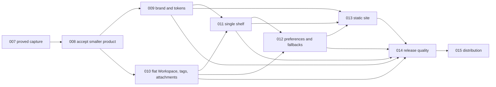

# Charon implementation plans

Originally generated with the `improve` skill on 2026-07-30, reconciled at
commit `9beb3fe` on 2026-08-04 after the operator simplified Charon around rapid
capture, then refined the same day to make lightweight Tags, managed
Attachments, and `Copy as Markdown` part of the smaller core. Plans 001-007 are
complete. The former TODO Plans 008-012 were replaced before implementation;
their obsolete Settings/Insights/broad-workflow direction must not be resumed
from git history.

Execute one remaining plan at a time in the order below. Every executor must
read `README.md`, product/architecture/privacy/UX or SITE contracts, relevant
ADRs, this index, and its complete plan. Run the plan drift check before changes,
honor every STOP condition, use Bun only for JavaScript/TypeScript and Cargo for
Rust, and update status only after all done criteria pass.

See [`plans/LAUNCH.md`](./LAUNCH.md) for the current development launch commands.

## Execution order and status

| Plan | Title | Priority | Effort | Depends on | Status |
|---|---|---:|---:|---|---|
| 001 | Freeze original product, domain, privacy, UX, and architecture contracts | P1 | M | - | DONE |
| 002 | Scaffold the pinned Bun monorepo and reproducible developer loop | P1 | L | 001 | DONE |
| 003 | Build the deep local Workspace module and typed IPC boundary | P1 | L | 002 | DONE |
| 004 | Establish the shared theme, desktop shell, and EN/FR localization | P1 | L | 002, 003 | DONE |
| 005 | Deliver the original note-management workflow | P1 | L | 003, 004 | DONE |
| 006 | Build ClipboardComposer and copy workflows | P1 | M | 005 | DONE |
| 007 | Build focus-preserving selected-text capture and native shortcuts | P1 | XL | 003-006 | DONE |
| 008 | [Refound Charon around rapid capture](./008-freeze-rapid-capture-product.md) | P1 | M | 001-007 | TODO |
| 009 | [Integrate the approved brand and Solarized-first token system](./009-integrate-brand-and-solarized-system.md) | P1 | M | 008 | TODO |
| 010 | [Simplify the Workspace and agent-ready copy domain](./010-simplify-workspace-and-copy-domain.md) | P1 | XL | 008 | TODO |
| 011 | [Build the single-shelf desktop experience](./011-build-single-shelf-desktop.md) | P1 | XL | 009, 010 | TODO |
| 012 | [Add minimal preferences and pragmatic platform fallbacks](./012-add-minimal-preferences-and-platform-fallbacks.md) | P1 | L | 010, 011 | TODO |
| 013 | [Build the brand-led static product site](./013-build-brand-led-static-site.md) | P1 | L | 009, 011, 012 | TODO |
| 014 | [Close rapid-capture release quality gaps](./014-close-rapid-capture-quality-gaps.md) | P1 | L | 009-013 | TODO |
| 015 | [Automate signed builds, static hosting, and releases](./015-automate-builds-and-releases.md) | P1 | XL | 014 | TODO |

Status values: `TODO`, `IN PROGRESS`, `DONE`, `BLOCKED: <reason>`, or
`REJECTED: <reason>`.

## Active handoff

Plan 007 completed on 2026-08-04 on branch `codex/007-quick-capture` at commit
`9beb3fe`. Its final macOS ad-hoc debug artifact passed the physical gesture,
focus, application-family, pasteboard restoration/concurrent-write, denial,
manual input, and restart matrix recorded in `docs/platform-support.md`.

The worktree was clean when this replanning started. No former Plan 008 source
work had begun: `/settings` and `/stats` were placeholders, no native preference
or diagnostics module existed, and the site remained a scaffold. The next
implementation is Plan 008 on branch `codex/008-rapid-capture-contracts`.

## Dependency graph



## Why this sequence changed

The operator rejected the breadth implemented through Plans 004-006, not the
local-first foundation or the physically proved selected-text capture. The
highest-leverage correction is therefore subtractive:

1. decide the new persistence, deletion, shortcut, and UI contracts before code;
2. install the already-approved visual identity and Solarized default;
3. migrate the domain without losing active or legacy trashed Markdown, then
   add lightweight Tags, managed Attachments, and one agent-ready copy format;
4. remove navigation and advanced workflow surfaces from the desktop while
   exposing those three capabilities contextually on each Note;
5. add only the settings needed for local folder choice and capture permissions;
6. tell that exact product story on a static site;
7. prove quality and distribution after the smaller product stabilizes.

Plan 008 is an ADR gate because the change affects persistence, permanent
deletion, shortcut behavior, the experimental chart boundary, UX, and contracts.
Plans 009-012 must stop unless ADR 0011 is accepted.

## Target product contract

Charon is a local rapid-capture shelf for people who use AI agents:

- Select non-empty text and press unmodified Shift twice on a proved macOS
  adapter: exactly one ordinary local Note is created without showing or focusing
  Charon.
- On every platform, `CmdOrCtrl+Shift+Space` reveals Charon and focuses the
  always-visible bottom composer. Enter creates one Note; empty input does nothing.
- The main window has no left rail or product routes. It contains approved Charon
  identity, search, Open/Done, a single Note stack, explicit selection, and the
  bottom composer.
- A hover/focus pencil or Enter expands the Note into one large Markdown editor
  with Write/Preview, autosave, draft preservation, and interruptible motion.
- Notes are flat: UUID, Markdown body, Open/Done, timestamps, an ordered set of
  lightweight Tags, and zero or more locally managed Attachments. No Sections,
  manual reorder, Move, Merge, Trash, hidden projects, or persisted Selection.
- Tags are optional text labels used by search and displayed as quiet chips.
  They have no colors, hierarchy, management route, or separate persisted registry.
- Adding an Attachment explicitly copies one regular file into the Note-owned
  `attachments/<note-id>/` directory inside the Workspace. Charon never keeps a
  fragile external source path, executes the file, previews arbitrary content,
  or uploads it.
- Each Note has one compact Actions button. `Copy as Markdown` produces a
  deterministic agent-ready document containing the body, Tags when present,
  and local Attachment paths when present. The explicit copy never reads
  attachment bytes, uploads, pastes, or changes Note state.
- Delete is an explicitly confirmed irreversible batch command. Completed
  deletion leaves no active or normal Charon transaction-backup copy; incomplete
  transaction recovery is bounded and cleaned after convergence.
- Existing schema v1 active Notes migrate byte-exactly. Already-trashed v1 bodies
  move to a visible user-owned legacy Markdown archive and never re-enter the app.
- Solarized is the default Charon identity. Light and Dark remain user choices.
- The user can choose another Notes folder; the visible safe default remains
  `Documents/Charon` because ordinary Markdown is an interoperability feature.
- Generic Error navigation disappears, but contextual, input-preserving,
  content-free failures and recovery actions remain.
- No account, sync, analytics, telemetry, crash upload, automatic Paste, or
  undisclosed network request enters the product.

## Target desktop design system

The approved brand kit source is:

`/Users/simonhazard/Documents/Codex/2026-07-31/j-aimerais-faire-un-logo-partir-2/outputs/charon-brand-kit-final/`

Authoritative brand primitives:

| Name | Value | Role |
|---|---|---|
| Charon Prune | `#171221` | primary dark/ink and action contrast |
| Charon Lavender | `#8F8BE8` | brand interaction accent |
| Charon Cream | `#F5F2EA` | primary light brand surface |
| Solarized Canvas | `#FDF6E3` | default canvas |
| Solarized Surface | `#EEE8D5` | default grouped/inset surface |
| Solarized Ink | `#073642` | default text |

The wordmark is vector artwork; system UI and system monospace fonts remain the
application type roles. The one signature element is a lavender crossing line,
derived from the icon's oar, which communicates capture arrival, active/selected
state, and the origin of the expanded editor. Everything else stays quiet: no
gradient, glow, emoji UI, generic bento, rounded-card grid, or permanent glass.

All components use semantic theme tokens. `@charon/theme` continues to export
CSS variables, theme names, radius, and motion contracts only. It contains no
assets, React, Astro, localization, native, or chart dependency. Each app owns
its approved asset copies and never imports the other app.

## Architecture after the pivot

The dependency direction remains:

```text
single-shelf UI -> versioned application commands -> domain modules -> adapters
```

- `Workspace` remains the durable filesystem, transaction, migration, conflict,
  and recovery boundary with real-filesystem and in-memory seams.
- `CaptureCoordinator` remains the shortcut/permission/selected-text boundary.
  It produces one flat Note action or a reveal-and-focus-composer action.
- `ClipboardComposer` remains the explicit clipboard-write boundary and composes
  one ordered agent-ready Markdown shape from Note body, Tags, and Attachment
  metadata. It resolves managed paths inside Rust and never reads file bytes.
- React owns search/filter/focus/Selection/editor draft/preferences-surface state
  and never reads or writes Workspace files.
- Desktop and site share only `@charon/theme` and never import each other.
- Astro stays static with real app media and no runtime API.

Do not add wrappers or services to compensate for removed entities. Deleting
features should delete conditions and dependencies, not create compatibility
abstractions around them.

## Fixed version ledger

All JavaScript/TypeScript dependencies are exact and all JavaScript commands use
Bun. All Rust dependencies use exact `=` pins and Cargo. The manifests and
lockfiles are authoritative for what is installed; this ledger is the reviewed
baseline at commit `9beb3fe`.

Plans 011 and 012 must remove obsolete manifest entries, lockfile nodes, and
their ledger rows in the same change after proving no consumer remains. Plan 015
may reintroduce updater/process dependencies only with signed, privacy-reviewed
release behavior. Do not float a version or hand-edit either lockfile.

### JavaScript and TypeScript baseline

| Package | Version | Pivot note |
|---|---:|---|
| Bun | `1.3.12` | sole JS package manager/runtime |
| `@biomejs/biome` | `2.5.6` | keep |
| root/desktop `typescript` | `7.0.2` | keep |
| site `typescript` | `6.0.3` | isolated Astro Check compatibility |
| `react`, `react-dom` | `19.2.8` | keep |
| `vite` | `8.2.0` | keep |
| `@vitejs/plugin-react` | `6.0.5` | keep |
| `@tauri-apps/cli` | `2.11.4` | keep |
| `@tauri-apps/api` | `2.11.1` | keep |
| `@tauri-apps/plugin-clipboard-manager` | `2.3.2` | review JS package; Rust plugin remains for `Copy as Markdown` |
| `@tauri-apps/plugin-dialog` | `2.7.2` | keep/review for folder and Attachment choosers |
| `@tauri-apps/plugin-fs` | `2.5.1` | removal candidate in Plans 011/012 |
| `@tauri-apps/plugin-global-shortcut` | `2.3.2` | Rust standard fallback remains |
| `@tauri-apps/plugin-process` | `2.3.1` | removal candidate until Plan 015 |
| `@tauri-apps/plugin-updater` | `2.10.1` | removal candidate until Plan 015 |
| `@tauri-apps/plugin-window-state` | `2.4.1` | retain if live native use remains |
| `@base-ui/react` | `1.6.0` | keep |
| `@tabler/icons-react` | `3.46.0` | keep |
| `motion` | `12.43.0` | keep inside desktop |
| `@tanstack/react-virtual` | `3.14.9` | keep for large flat Note lists |
| `@tanstack/react-router` | `1.170.18` | remove in Plan 011 |
| `@tanstack/router-plugin` | `1.168.23` | remove in Plan 011 |
| `@tanstack/react-hotkeys` | `0.10.0` | remove in Plan 011 |
| `cmdk` | `1.1.1` | remove with command palette |
| `class-variance-authority` | `0.7.1` | keep while Base UI components use it |
| `clsx` | `2.1.1` | keep if imported |
| `tailwind-merge` | `3.6.0` | keep if imported |
| `tailwindcss`, `@tailwindcss/vite` | `4.3.3` | keep |
| `tw-animate-css` | `1.4.0` | retain only if a live component imports its output |
| `shadcn` | `4.16.0` | source/tooling only; review direct runtime need |
| `zod` | `4.4.3` | remove if Plan 011 confirms no consumer |
| `@inlang/paraglide-js` | `2.23.0` | keep |
| `vitest` | `4.1.10` | keep |
| `jsdom` | `30.0.1` | keep |
| `@testing-library/react` | `16.3.2` | keep |
| `@testing-library/user-event` | `14.6.1` | keep |
| `@playwright/test` | `1.62.0` | keep/plumb in Plan 014 |
| `@axe-core/playwright` | `4.12.1` | keep/plumb in Plan 014 |
| `@types/react` | `19.2.17` | keep |
| `@types/react-dom` | `19.2.3` | keep |
| `@types/node` | `26.1.2` | keep |
| `astro` | `7.1.6` | keep |
| `@astrojs/check` | `0.9.10` | keep until TypeScript 7 support is proved |
| `@astrojs/sitemap` | `3.7.3` | keep |
| `sharp` | `0.35.3` | keep for real media |

TanStack Charts, React Charts, D3 array/scale, and their type packages are
removed from the planned ledger. They were never installed and Insights is now
explicitly rejected.

### Rust baseline

| Crate | Version | Pivot note |
|---|---:|---|
| `tauri` | `2.11.5` | keep |
| `tauri-build` | `2.6.3` | keep |
| `serde`, `serde_json` | `1.0.229`, `1.0.151` | keep |
| `uuid` | `1.24.0` | keep |
| `tempfile` | `3.27.0` | keep for tests |
| `thiserror` | `2.0.19` | keep |
| `notify` | `8.2.0` | keep Workspace watcher |
| `pulldown-cmark` | `0.13.4` | keep safe Markdown preview path if still used |
| `ts-rs` | `12.0.1` | keep typed IPC generation |
| `tauri-plugin-clipboard-manager` | `2.3.2` | keep explicit `Copy as Markdown` |
| `tauri-plugin-dialog` | `2.7.2` | keep folder and Attachment choosers |
| `tauri-plugin-global-shortcut` | `2.3.2` | keep portable shortcut |
| `tauri-plugin-single-instance` | `2.4.3` | keep if lifecycle use remains |
| `tauri-plugin-window-state` | `2.4.1` | keep if lifecycle use remains |
| `tauri-plugin-fs` | `2.5.1` | remove in Plan 012 if no call site |
| `tauri-plugin-process` | `2.3.1` | remove until Plan 015 if unused |
| `tauri-plugin-updater` | `2.10.1` | remove until Plan 015 |
| `core-foundation`, `core-graphics` | `0.10.1`, `0.25.0` | keep macOS capture |
| `objc2`, `objc2-app-kit`, `objc2-foundation` | `0.6.4`, `0.3.2`, `0.3.2` | keep macOS public APIs/pasteboard |

## Findings considered and rejected

- **Keep the old rail as an optional mode**: rejected. A second presentation
  preserves the condition/route burden the operator explicitly wants removed.
- **Retain Sections internally for future organization**: rejected for current
  schema/commands. Flat Notes are the accepted product; future hierarchy needs
  a new ADR and migration.
- **Keep recoverable Trash/Undo while hiding its navigation**: rejected. It
  contradicts explicit permanent deletion and leaves Charon-owned content copies.
- **Delete immediately with no confirmation**: rejected. One concise explicit
  confirmation is the minimum agency required for irreversible batch deletion.
- **Remove every error/recovery state**: rejected. Generic Error navigation is
  noise; contextual input-preserving failures are required for trustworthy local files.
- **Move the default to opaque application data**: rejected. `Documents/Charon`
  makes Markdown visible to users, backup tools, editors, and agents; the chooser
  covers people who want another location.
- **Promise double Shift on Linux/Windows via low-level hooks**: rejected until
  signed native evidence passes the existing gates. Standard shortcut and composer
  are the pragmatic cross-platform contract.
- **Remove list virtualization to make editor animation easier**: rejected. A
  flat local Workspace still supports large collections; nested/shared motion
  must coexist with bounded DOM.
- **Keep command palette and broad shortcut help**: rejected. Contextual standard
  keys plus capture help cover the smaller product.
- **Add a tag sidebar, color taxonomy, nested labels, or tag-management route**:
  rejected. Tags remain lightweight Note metadata surfaced through chips and search.
- **Persist Attachment source paths instead of copying files into Workspace**:
  rejected. External references break when files move and weaken the Workspace
  portability boundary.
- **Render arbitrary Attachment previews or copy/upload their bytes to an agent**:
  rejected. Charon shows safe metadata and copies local paths only after the
  explicit `Copy as Markdown` action; the user controls any later agent upload.
- **Add Insights/TanStack Charts later in v1**: rejected, not deferred. The route,
  chart tokens, feature boundary, and ledger entries leave the product.
- **Share logos through `@charon/theme`**: rejected by ADR 0004. Each app owns
  approved copies; only semantic tokens cross the boundary.
- **Build fake Charon UI in Astro**: rejected. Site media must come from the real app.

## Plan maintenance

- If a TODO plan drifts, update its planned-at SHA, current-state excerpts, scope,
  and commands before execution; do not silently reinterpret it.
- Completed original plans remain historical evidence even when later plans
  intentionally remove their product features.
- A blocked plan names the repeated concrete blocker. Difficulty, uncertainty,
  or a useful clarification alone is not a blocked status.
- Do not push, publish, tag, deploy, install artifacts, or open a pull request
  unless the operator explicitly authorizes that action.
