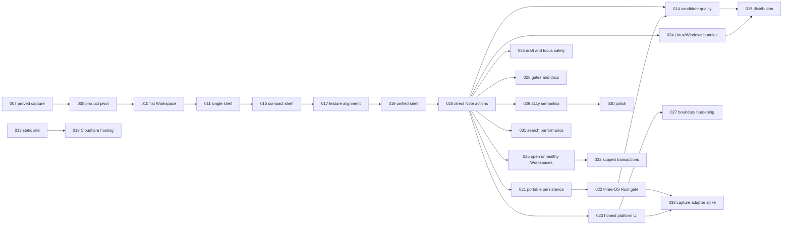

# Charon implementation plans

This directory is the single implementation queue. Completed plans remain as
historical evidence even when a later ADR removes their product choices. Read
the current contract and the active plan; never resume a superseded feature from
an older plan.

The product pivot is governed by
[ADR 0011](../docs/adr/0011-rapid-capture-product.md). The unified shelf,
Light/Graphite appearances, direct row actions, editor transition, and
Attachment picker permission are governed by
[ADR 0012](../docs/adr/0012-unified-note-shelf.md).
Direct per-Note actions and the removal of Selection are governed by
[ADR 0013](../docs/adr/0013-direct-note-actions.md).

## Active handoff

Plan 020 is the current desktop plan on branch `codex/020-remove-selection`,
based on `e1e63c5`. It removes Note Selection and makes status, copy, Edit, and
confirmed permanent Delete direct per-Note actions. Automated checks pass except
for Playwright, whose local server is blocked by this environment's exhausted
approval service. It carries forward one native macOS Attachment-picker click
and a normal-speed unfold/fold feel check.

Plan 018 is independently `AWAITING OPERATOR` for Cloudflare/GitHub environment
configuration and the first authorized matching `main` deployment. It does not
change desktop release readiness.

After Plan 020, Plan 014 closes the exact-candidate quality matrix. Plan 015
then defines protected GitHub Release artifacts and optional Tauri-signed
updates without pretending ad-hoc macOS or unsigned Windows artifacts have paid
publisher identity.

## Advisory audit of 2026-08-17 (Plans 021-033)

On 2026-08-17 a read-only advisory audit (correctness, security, performance,
tests, DX, docs, UX/a11y/motion, and Linux/Windows/macOS portability) was run
against commit `f2b1bbd`. It produced Plans 021-033 below. They are handoff
plans written for an executor with no other context: each one is
self-contained, stamps `f2b1bbd`, and starts with a drift check. None has been
executed yet. Ordering rationale: cross-platform correctness and its CI gate
first (the operator's stated goal), then data-safety and security fixes, then
UX/a11y and performance, then the capture-adapter spike.

Recommended execution order: 021 → 022 → 023 → 024 → 025 → 026 → 027 → 028 →
029 → 030 → 031 → 032 → 033. Plans 023, 024, 026, 027, 028 are independent of
021/022 and can run in parallel branches. Plan 014/015 remain in the queue after
these; 015 must reuse 022's matrix and 024's bundle config.

### What each new plan does, in one line

| Plan | In plain words |
| --- | --- |
| 021 | Make the Rust file layer actually work on Windows (verbatim `\\?\` paths, `/` joins, watcher filter, in-memory test double, preferences fsync) and fall back safely on Linux when there is no Documents folder. |
| 022 | Bring back a CI job that compiles and tests the Rust core on Windows and macOS on every change, pin the Rust toolchain, and document Linux/Windows prerequisites. Also asks the operator to look at why `Quality` on `main` is currently red. |
| 023 | Stop the Help popover from advertising macOS-only double-Shift capture everywhere; show ⌘ or Ctrl correctly; show when the global shortcut failed to register (Wayland/conflicts); make a second launch focus the running window; make the drag strip actually drag. |
| 024 | Configure `tauri.conf.json` so `tauri build` produces `.deb`/AppImage/`.rpm` on Linux and NSIS/MSI on Windows (with an offline-friendly WebView2 install mode), and drop mobile leftovers. |
| 025 | Stop refusing to open a Workspace just because one stray `.md` or a missing attachment/note file exists; report the issue instead. Also: never let migration delete a pre-existing `legacy-trash-v1/`, and let Copy report a real `stale_revision`. |
| 026 | Keep the composer focused after Enter, never lose a draft when the editor row scrolls out or the window closes, never say "Saved" after a failed save, and refresh the list when the window regains focus. |
| 027 | Tighten the webview CSP, replace `core:default` with the few permissions used, remove four unused IPC commands, add site security headers, harden CI checkout, add `.env.example`, and (optional) move the Attachment picker into Rust so the webview never handles source paths. |
| 028 | Repair gates that are red or hollow: Biome linting `.claude/`, the weekly security workflow that cannot pass, dead privacy-sentinel patterns, tautological privacy tests, an IPC command-name parity check, Dependabot, and stale doc statements. |
| 029 | Accessibility: announce Done/Delete, real list semantics for the virtual list, whole-row activation, ≥3:1 focus rings, 44px hit targets, focus to the nearest row after Delete, plural "attachment", `lang` at boot, dialog under reduced transparency, arrow keys that always land on a row. |
| 030 | Polish: accent-insensitive search, valid Markdown preview structure, French non-breaking spaces, auto-clearing "Copied", press feedback under reduced motion, stable scrollbar gutters, decide the inert row layout animation, delete dead messages. |
| 031 | Make search cheap at 20k Notes (incremental index, memoized contexts, stable Note identity) and make the perf gate benchmark the real `filterNotes`. |
| 032 | Stop rewriting and double-backing-up the whole Workspace on every command; run IPC commands off the main thread; bound attachment-import memory; emit events on error paths. Design-first with characterization tests. |
| 033 | Spike (not a build): what selected-text capture can honestly look like on Windows, Linux X11, and Wayland; produces ADR 0014 and evidence, then the operator decides. |

See [LAUNCH.md](./LAUNCH.md) for development commands.

## Status

| Plan | Title | Status |
| --- | --- | --- |
| 001 | Freeze original contracts | DONE |
| 002 | Scaffold the Bun/Tauri monorepo | DONE |
| 003 | Build the deep local Workspace | DONE |
| 004 | Establish themes, shell, and localization | DONE |
| 005 | Deliver the original Note workflow | DONE |
| 006 | Build ClipboardComposer | DONE |
| 007 | Prove selected-text capture and native shortcuts | DONE |
| 008 | Refound Charon around rapid capture | DONE |
| 009 | Integrate the original brand/theme system | DONE |
| 010 | Simplify Workspace and agent-ready copy | DONE |
| 011 | Build the single-shelf desktop | BLOCKED: remaining physical accessibility and motion matrix |
| 012 | Add Preferences and platform fallbacks | BLOCKED: remaining native platform matrix |
| 013 | Build the static product site | DONE |
| 016 | Retarget the desktop to a compact shelf | DONE |
| 018 | Host the static site on Cloudflare Workers | AWAITING OPERATOR: secrets, authorized main run, and NEL setting |
| 017 | Align all workflows inside the compact shelf | REJECTED: presentation replaced by ADR 0012 and Plan 019 |
| 019 | Simplify the unified Note shelf | REJECTED: Selection interaction replaced by ADR 0013 and Plan 020 |
| 020 | Remove Note Selection | AWAITING OPERATOR: Playwright sandbox approval, native Attachment picker, and packaged motion feel |
| 021 | Make Workspace and preferences persistence portable to Windows and Linux | DONE |
| 022 | Restore an automatic three-OS Rust verification gate | AWAITING OPERATOR: first Portability run deferred until final CI pass |
| 023 | Make the desktop shelf honest and functional on every platform | TODO |
| 024 | Configure Linux and Windows bundles | TODO |
| 025 | Open unhealthy Workspaces with reported issues; guard the legacy archive; pass Copy errors | TODO |
| 026 | Keep the composer focused, never lose a draft, report failed saves | TODO |
| 027 | Harden the webview, IPC, site, and CI boundaries | TODO after 023 |
| 028 | Repair the verification gates and reconcile stale documentation | TODO |
| 029 | Expose Note state to assistive tech, fix focus movement, meet 44px targets | TODO |
| 030 | Polish search matching, preview structure, motion, feedback, and copy | TODO after 029 |
| 031 | Make search and rendering cheap at 20k Notes; benchmark the real search | TODO |
| 032 | Scope transactions to what changed; move IPC work off the main thread | TODO after 025 |
| 033 | Spike: Linux/Windows selected-text capture adapters (ADR 0014 draft) | TODO after 021, 022, 023 |
| 014 | Close exact-candidate quality gaps | TODO after 020 and the 021-024 portability plans |
| 015 | Publish protected GitHub Releases and optional updates | TODO after 014 (reuse 022's matrix and 024's bundle config) |

Status values are `TODO`, `IN PROGRESS`, `AWAITING OPERATOR: <reason>`, `DONE`,
`BLOCKED: <reason>`, and `REJECTED: <reason>`.

## Dependency path

## Dependency notes for Plans 021-033

- 022 requires 021: a Windows `cargo test` job cannot be green until the
  in-memory storage keys, the watcher filter, and the verbatim-path joins are
  fixed.
- 027 should follow 023: 023 adds `core:window:allow-start-dragging`; 027
  narrows `core:default` and must keep it.
- 030 depends on 029's shared live region for its feedback steps.
- 032 depends on 025 because both edit `workspace/mod.rs` and `recovery.rs`;
  032 Step 5 is the only HIGH-risk step in the set and is gated on its own
  Step 1 characterization tests.
- 033 is a spike; it needs the app to run on Linux/Windows first (021-023).
- 014 and 015 remain the release path; 015 must reuse 022's matrix shape and
  024's bundle configuration rather than re-deriving them.

## Findings considered and rejected on 2026-08-17

Recorded so they are not re-audited. Evidence and reasoning are in the plans'
"Maintenance notes" where relevant.

- Directory fsync being Unix-only in `workspace/storage.rs::sync_dir` — correct
  by construction (Windows cannot fsync directories); the preferences copy of
  it was the bug (Plan 021).
- Uppercase UUIDs accepted by `validate_uuid` — only reachable via a hand-edited
  manifest; deferred (noted in Plan 021).
- Windows ACL hardening equivalent to `0o600` — low exposure under
  `%USERPROFILE%`; document instead of implementing (Plan 021 note).
- OneDrive-redirected `Documents` on Windows — a product/disclosure decision,
  not a bug; raise with the operator when Windows evidence exists.
- Mobile leftovers (`staticlib`/`cdylib`, `bundle.android`, `icons/{android,ios}`)
  — folded into Plan 024, not a standalone finding.
- `recoveryLocation` never rendered / `/`-separated — dead DTO field; revisit
  when the recovery UI is redesigned.
- Repeated full manifest validation per command (4-5×) — deliberate
  defense-in-depth on the persistence boundary; measure after Plan 032.
- Preferences read-modify-write race between workspace switch and update —
  cosmetic worst case; not worth a lock now.
- `@tauri-apps/api` 2.11.1 vs `tauri` crate 2.11.5 — independent release
  trains; `bindings:check` guards the type surface.
- TypeScript 7.0.2 (root/desktop) vs 6.0.3 (site) — deliberate, documented in
  `apps/site/package.json`.
- Tauri isolation pattern — not justified with no HTML sink and a complete CSP
  (after Plan 027).
- Zeroizing pasteboard snapshot buffers — meaningful only against a local
  attacker who can already read process memory.
- TOCTOU windows around `symlink_metadata`/`canonicalize`/open in
  `read_external_regular` — same-user local process only; the post-read
  size/mtime recheck already narrows it.
- Site: no `prefers-color-scheme` and no language switcher — decided in
  `docs/SITE.md`.
- Hover-only reveal of row actions, no exit animation on deleted rows, no
  opacity transition on the action reveal — decided in `docs/UX.md`.
- Motion: whether the editor's own 1.5% `scaleY` earns its place — taste call;
  revisit inside Plan 030 Step 7 only if the layout animation decision changes it.
- A Markdown library for Preview — direction, needs an ADR-level privacy/XSS
  decision (Plan 030 note); the current renderer has no HTML sink.
- Per-Note conflict UI when an external edit races a dirty draft — needs a
  Rust-side per-Note precondition; recorded as a follow-up in Plan 026.

## Current product boundary

- One local `Workspace`, one flat Note collection, one unified searchable list.
- Done is a visible Note property, not a filter or destination.
- Optional flat Tags and Note-owned managed Attachments only.
- Direct per-Note status, `Copy as Markdown`, Edit, and confirmed Delete; no
  Selection or bulk Note commands.
- One large editor expanding from the live row; one always-visible body-only
  composer.
- Light by default, Graphite optional; legacy Solarized preferences resolve to
  Light.
- No Sections, hierarchy, routes, manual order, Move, Merge, Trash, Undo,
  CopyPresets, command palette, Insights, account, sync, telemetry, or automatic
  Paste.
- Static media-free public holding page with no browser runtime or Worker code.

## Toolchain authority

`package.json`, workspace manifests, `Cargo.toml`, `bun.lock`, and `Cargo.lock`
are the exact version ledger. Dependencies stay pinned. Regenerate lockfiles
with Bun or Cargo; never copy a version from an old plan over the current
manifests.

JavaScript and TypeScript commands use Bun only. Rust commands use Cargo. The
desktop runtime is React, Vite, Base UI, Tabler, Motion, TanStack Virtual,
Tailwind, Paraglide, Tauri, and the focused native plugins in its manifests.
The public site is static Astro deployed by the site-owned Wrangler CLI.

## Plan maintenance

- Execute one product plan at a time and run its drift check before editing.
- Stop on overlapping user changes or on a stated STOP condition.
- Update a drifting TODO plan explicitly; do not reinterpret it silently.
- Keep completed plans and accepted ADRs as history, but remove abandoned
  parallel queues, generated plans with no owner, and references to them.
- Mark `DONE` only after every automated and required physical criterion passes.
- Do not push, publish, deploy, tag, or open a pull request without explicit
  operator authority.
